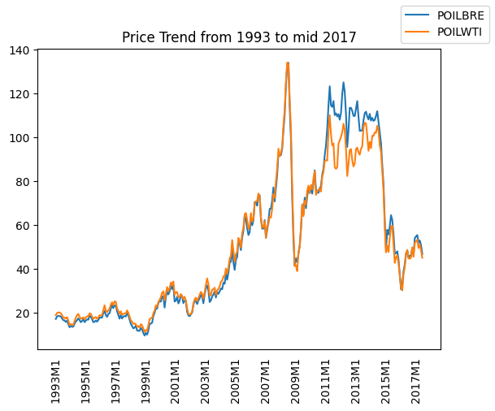
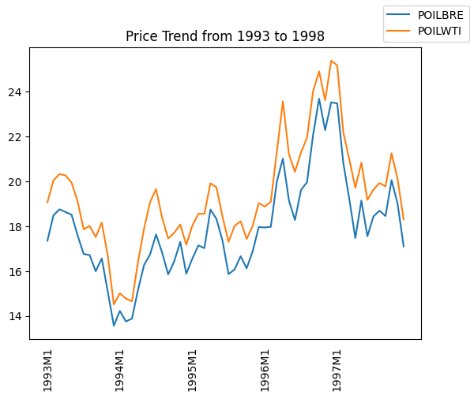
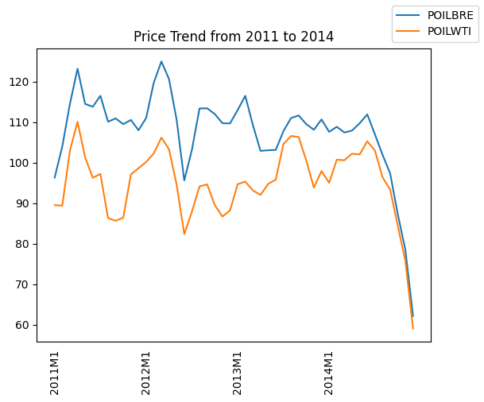
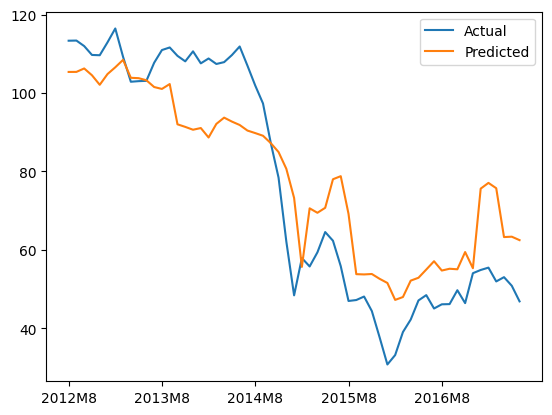
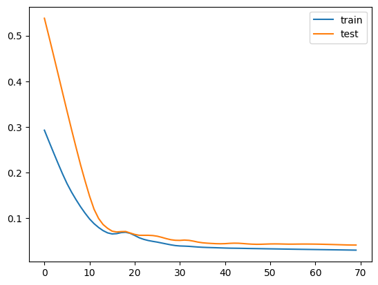
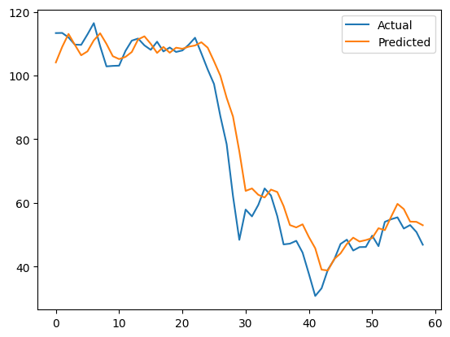

# Summary of Analysis

#### Author: Xavier Santimano

---

### Relationship between Brent Crude Oil (POILBRE) and West Texas Intermediate Oil (POILWTI) Prices

**Price Plot of POILBRE and POILWTI from 1993 to mid 2017**

Comparing these two commodities, I found varying relationships throughout the time-series. From 1993 to 2011, there is a positive spread, with POILWTI priced higher. This spread is small (averaging ~ $1.3) but consistent.

**Price Plot between 1993 to 1998** 
Positive spread generally holds until 2011. 

There was a seismic shift between 2011 to 2014, with POILBRE being priced an average of ~ $12.6 higher than POILWTI - a huge price differential. Reasons for this shift are chalked up to limits in pipeline capacity for POILWTI and shifts in demand. 

**Price Plot between 2011 to 2014**

From 2014 onwards, the relationship from 2011 to 2014 generally follows, with POILWTI being charged at a discount to POILBRE.

From the above, I became more certain as to why the LSTM model might outperform other traditional ML models. Being able to update key information as well as forget information (across all features) would be especially useful in ensuring optimum forecast accuracy for POILBRE.
 
 ---

### LSTM model vs other ML models

For this project, I was primarily interested in assessing the usefulness of the Long Short-Term Memory (LSTM) model in forecasting commodity prices (namely, POILBRE) over other traditional Machine Learning (ML) models.

Utilising all relevant features made available in the dataset, I found that the LSTM model outperformed other ML models (namely Linear Regression, Random Forest, ARIMA and its variants) by a noticeable margin.

With an 80/20 split of monthly data ranging from 1993 to mid 2017, these were the Mean Absolute Errors (MAEs) of the models:

> Note that the min, max price POILBRE is 9.8, 133.9 ($USD)

| Model | Mean Absolute Error |
|---|---|
| Long Short-Term Memory | 3.274 |
| Linear Regression | 13.473 |
| Random Forest | 11.440 |
| ARIMA | 17.985 |
| SARIMA | 21.087 |
| SARIMAX | 12.024 |

> LSTM model performance will vary across runs

Comparing the plots of the LSTM model against the Random Forest model, I found that the LSTM model more closely follows the true behaviour of the time series.

**LSTM Actual vs Predicted Plot** 

**Random Forest Actual vs Predicted Plot** 

---

### Dimensionality Reduction

Instead of absent-mindedly throwing all features into the model, I was also interested in optimising model performance by only including the features with the most predictive power. For this project, I tried utilising only the top 9 features to forecast POILBRE, as opposed to all 53 of them.

The top 9 features, with correlations from 87.6% up to 99.9%, are: 
1. Oil Asia-Pacific Spot Price
2. Oil Dubai
3. Oil West Texas Intermediate 
4. Natural Gas Japan Price
5. Copper
6. Natural Gas Europe Price
7. Tin
8. Refined Oil Price
9. Coal Australia Price

> More market research, possibly leading to additional feature engineering can be done to include features with the most explanatory power for forecasting POILBRE - improving model performance further

Here were the Mean Absolute Errors (MAEs) of the original models and the dimensionally-reduced models:

| Model | Mean Absolute Error |
|---|---|
| Original Long Short-Term Memory | 3.274 |
| Reduced Long Short-Term Memory | 2.473 |
| Original Random Forest | 11.440 |
| Reduced Random Forest | 7.749 |

> LSTM model(s) performance will vary across runs

By decluttering the feature set, I found a noticeable improvement in the performance of these two models.

For a better understanding of the improvement gained from dimensionality reduction, we could compare the difference between the LSTM model's Validation Plot and its Actual vs Predicted Plot.

**Original LSTM Validation Plot** 

**Reduced LSTM Validation Plot** 

**Original LSTM Actual vs Predicted Plot** 

**Reduced LSTM Actual vs Predicted Plot** 

In the reduced LSTM plot, the model followed the trend of the time series more tightly. Like other models, it slightly overestimated the price from 2014 onwards, and so we could make further adjustments to negatively bias the forecast post 2014 for improved performance.

---

### Conclusion

I learnt about the dynamic nature of physical commodities (with reference to the change in relationship between POILBRE and POILWTI). Besides monitoring these pair-wise relationships, I would say that understanding how various other factors (e.g. supply chain, geopolitical, environmental, etc.) can impact the relationship between commodities and their prices is necessary to make trading decisions with the highest precision.

With relation to the LSTM model, I found that it is a powerful tool for forecasting commodity prices. It could be especially useful for immediate buy/sell strategies and also futures contracts. To create a more robust and high-performance model, it would be interesting to experiment with more feature engineering, more advanced LSTM models and hybrid LSTM models (e.g. comparing effectiveness of ARIMA for short-term predictions).
