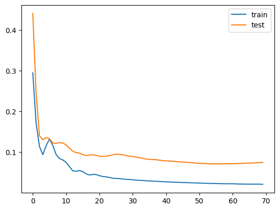
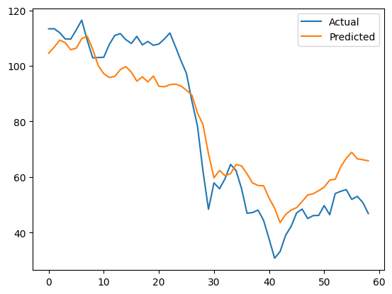
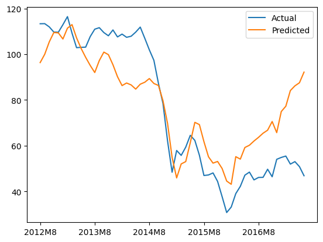
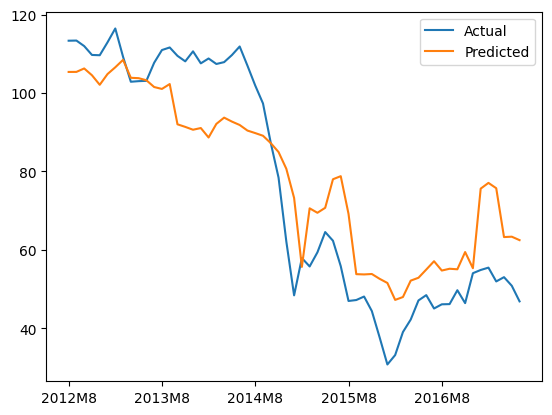
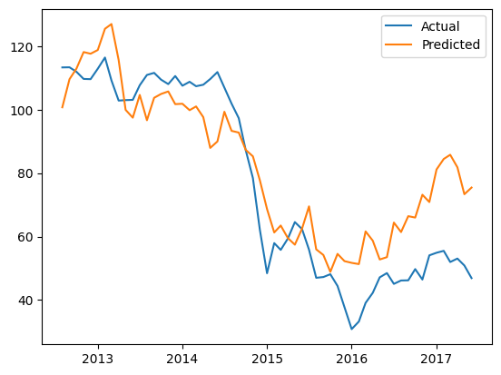

# Forecasting Brent Crude Oil Prices

## Index:
1. [Description](#1-description)  
2. [Dependencies](#2-dependencies)  
3. [Model Results](#3-model-results)  
4. [To-Do](#4-to-do) 

---

### [1] Description

Practice with the Long Short-Term Memory (LSTM) model with a focus on physical energy commodities. 

In this project, I am interested in experimenting with LSTMs as their ability to handle sequential data allows them to analyse long-term dependencies between time steps of data. I am also interested in comparing the LSTM model vs other models.

This project is inspired by this [article](https://medium.com/@vinayarun/from-scratch-an-lstm-model-to-predict-commodity-prices-179e12445c5a) on forecasting commodity prices using an LSTM model. 

#### **Findings**
I find that the LSTM model beats more traditional models with respect to forecasting prices of Brent Crude Oil. This could be due to the long-term dependencies captured in the aforementioned target variable. In fact, the time series shows multiple patterns that **sometimes** last a long time. As such, the model's ability to capture these dependencies, whether linear or non-linear, and also forget information that is no longer important may have allowed it to excel in this scenario.

On the flipside, models like ARIMA may struggle due to the non-linear trend of the data along with its preference for short-term forecasting (in this case, we are validating ~ 60 data points representing 60 months).

---

### [2] Dependencies:

#### **Exporting Dependencies**
If any packages/dependencies are updated via poetry, be sure to export the requirements.txt using the following:
`poetry export --without-hashes -f requirements.txt -o requirements.txt`

#### **Installing Dependencies**
Run the following the your command line:
`pip install -r requirements.txt`

---

### [3] Model Results

#### **LSTM Model Results**
- Validation Plot 

- Actual vs Predicted Plot 

> We observe an MAE of ~ 3.

#### **Other ML Models Results**
- Linear Regression Validation Plot 

- Random Forest Validation Plot 

- SARIMAX Validation Plot 

> We observe an MAE between ~ 11-13 for these models.

---

### [4] To-Do

1. Explore relationship between Brent Crude Oil Prices and other variables in the dataset, including lags (another .ipynb)
2. MinMax Scale X_train for linear regression and exog for SARIMAX, observe if MAE has noticeable decrease
