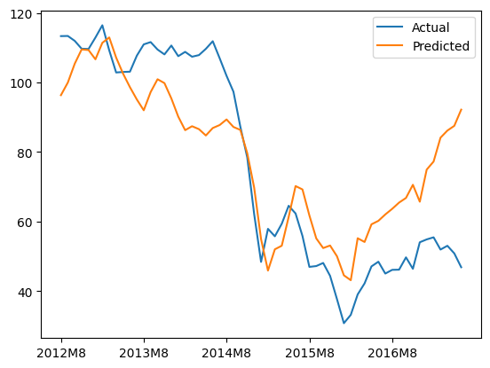
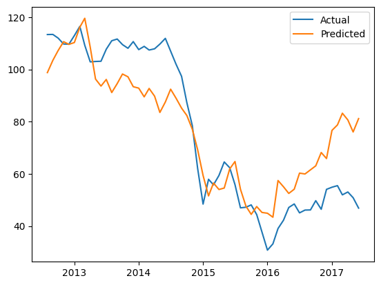

# Forecasting Brent Crude Oil Prices

## Index:
1. [Description](#1-description)  
2. [Dependencies](#2-dependencies)  
3. [Model Results](#3-model-results)  
4. [To-Do](#4-to-do) 

---

### [1] Description

Practice with the Long Short-Term Memory (LSTM) model with a focus on physical energy commodities, specifically Brent Crude Oil prices. 

In this project, I am interested in experimenting with the LSTM models as its ability to handle sequential data allows it to analyse long-term dependencies between time steps of data. I am also interested in comparing the LSTM model vs other models.

This project is inspired by this [article](https://medium.com/@vinayarun/from-scratch-an-lstm-model-to-predict-commodity-prices-179e12445c5a) on forecasting Brent Crude Oil price using an LSTM model. 

#### **Findings**
I found that the LSTM model beats more traditional models with respect to forecasting prices of Brent Crude Oil. This could be due to the long-term dependencies captured in the aforementioned target variable. In fact, the time series shows multiple patterns that **sometimes** last a long time. As such, the model's ability to capture these dependencies, whether linear or non-linear, and also forget information that is no longer important may have allowed it to excel in this scenario.

On the flipside, models like ARIMA may struggle due to the non-linear trend of the data along with its preference for short-term forecasting (in this case, we are validating ~ 60 data points representing 60 months).

> **📊 For a more detailed analysis, refer to [this](https://github.com/xavsant/brent_crude_prices/blob/main/ANALYSIS.md) file**

---

### [2] Dependencies:

#### **Exporting Dependencies**
If any packages/dependencies are updated via poetry, be sure to export the requirements.txt using the following:
`poetry export --without-hashes -f requirements.txt -o requirements.txt`

#### **Installing Dependencies**
Run the following the your command line:
`pip install -r requirements.txt`

---

### [3] Model Results

#### **LSTM Model Results**
**LSTM Validation Plot** 

**LSTM Actual vs Predicted (AvP) Plot** 

> Plots may differ from what is seen in .ipynb due to re-runs.

#### **Other ML Models Results**
**Linear Regression AvP Plot** 

**Random Forest AvP Plot** 

**SARIMAX AvP Plot** 

---

### [4] To-Do

1. Explore relationship between Brent Crude Oil Prices and lagged variables by day (current dataset is monthly)
2. Enhance existing LSTM model and experiment with other models
3. Develop quantitative strategy in tandem with market behaviour
4. Add detailed explanation on dataset and evaluation methods
5. Analyse variables with suprisingly high correlation to POILBRE (namely copper and tin)
